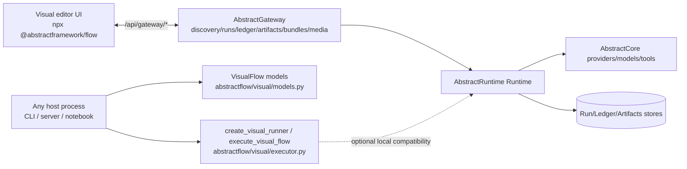

# AbstractFlow

Diagram-based, **durable** AI workflows for Python.

AbstractFlow is part of the [AbstractFramework ecosystem](https://github.com/lpalbou/AbstractFramework).
The editor is Gateway-first: AbstractFlow talks to AbstractGateway for discovery, persistence,
runs, ledgers, artifacts, and media. Gateway owns the Runtime/Core deployment stack.

It provides:
- A small programmatic API (`Flow`, `FlowRunner`) for building and running flows in Python.
- A portable workflow format (`VisualFlow` JSON) + helpers to execute it from any host (`abstractflow.visual`).
- A Gateway-first visual editor app in `web/` (React frontend + `/api/gateway/*` proxy).

Project status: **Pre-alpha** (`pyproject.toml`: `Development Status :: 2 - Pre-Alpha`). Expect breaking changes.

Evidence (code): [abstractflow/runner.py](abstractflow/runner.py), [abstractflow/visual/executor.py](abstractflow/visual/executor.py), [abstractflow/cli.py](abstractflow/cli.py), [web/backend/routes/ws.py](web/backend/routes/ws.py).

## Diagram (how it fits together)



## Docs

Published documentation: https://www.lpalbou.info/AbstractFlow/

- Getting started: [docs/getting-started.md](docs/getting-started.md)
- API (high-level): [docs/api.md](docs/api.md)
- Architecture: [docs/architecture.md](docs/architecture.md)
- FAQ: [docs/faq.md](docs/faq.md)
- VisualFlow JSON format: [docs/visualflow.md](docs/visualflow.md)
- CLI: [docs/cli.md](docs/cli.md)
- Visual editor: [docs/web-editor.md](docs/web-editor.md)
- Docs index: [docs/README.md](docs/README.md)

## Installation

```bash
pip install abstractflow
```

Requirements: Python **3.10+** (`pyproject.toml`: `requires-python`).

Optional extras (declared in `pyproject.toml`):
- Host profiles for local programmatic/VisualFlow execution compatibility (`Flow`, `FlowRunner`, `execute_visual_flow`, workflow bundles): `pip install "abstractflow[apple]"` or `pip install "abstractflow[gpu]"`
- Full host profiles:
  - Apple-capable: `pip install "abstractflow[apple]"`
  - GPU-capable: `pip install "abstractflow[gpu]"`
- `abstractflow[apple]` and `abstractflow[gpu]` pull the matching `abstractgateway[...]` host profile and Visual Agent support. Flow no longer names `AbstractRuntime` or `abstractcore` directly in these profiles; Gateway owns that deployment stack. AbstractFlow `0.3.15` expects Gateway `>=0.2.20` for the current image/video media, progress, catalog, and residency contracts.
- Agent nodes only, without the host profile: `pip install "abstractflow[agent]"`
- Documentation site tools: `pip install "abstractflow[docs]"`

## Quickstart (programmatic)

```python
# Requires: `abstractflow[apple]` or `abstractflow[gpu]`
from abstractflow import Flow, FlowRunner

flow = Flow("linear")
flow.add_node("double", lambda x: x * 2, input_key="value", output_key="doubled")
flow.add_node("add_ten", lambda x: x + 10, input_key="doubled", output_key="final")
flow.add_edge("double", "add_ten")
flow.set_entry("double")

print(FlowRunner(flow).run({"value": 5}))
# {"success": True, "result": 20}
```

## Quickstart (execute a VisualFlow JSON)

```python
import json
from abstractflow.visual import VisualFlow, execute_visual_flow

# Requires: `abstractflow[apple]` or `abstractflow[gpu]`
with open("my-flow.json", "r", encoding="utf-8") as f:
    vf = VisualFlow.model_validate(json.load(f))

print(execute_visual_flow(vf, {"prompt": "Hello"}, flows={vf.id: vf}))
```

If your flow uses subflows, load all referenced `*.json` into the `flows={...}` mapping (see [docs/getting-started.md](docs/getting-started.md)).

## Visual editor (Gateway-first)

The visual editor talks to AbstractGateway. The Flow server keeps the Gateway bearer token server-side while proxying browser requests.

```bash
# Terminal 1: Gateway
pip install "abstractgateway[http]" abstractflow
export ABSTRACTGATEWAY_AUTH_TOKEN=dev-token
abstractgateway serve --port 8080

# Terminal 2: editor UI (static server + /api/gateway proxy)
export ABSTRACTGATEWAY_AUTH_TOKEN=dev-token
npx @abstractframework/flow --gateway-url http://127.0.0.1:8080
```

Open:
- UI: http://localhost:3003
- Gateway capabilities: http://localhost:8080/api/gateway/discovery/capabilities

Media nodes use Gateway as the catalog and execution source. Generate Image,
Edit Image/Image-to-Image, Generate Video, Image-to-Video, Generate Voice,
Generate Music, Transcribe Audio, and Listen Voice expose Gateway Media controls
populated from catalog routes such as
`/api/gateway/vision/models`, `/api/gateway/vision/provider_models`,
`/api/gateway/voice/voices`, `/api/gateway/audio/speech/models`,
`/api/gateway/audio/transcriptions/models`, and
`/api/gateway/audio/music/{providers,models}`. When Gateway exposes
`common.readiness`, Flow uses it as a conservative surface-readiness overlay
while still resolving concrete calls from endpoint descriptors. Generated images,
videos, voice, and music are artifacts; the Run modal renders previews/players
from Gateway artifact content and keeps `abstract.progress` ledger events visible
for long media runs while leaving raw ledger JSON available for debugging.

The `abstractflow serve`/FastAPI host is a Gateway proxy by default. Its old local `/api/flows`, `/api/ws`, and `/api/runs` compatibility routes are available only when `ABSTRACTFLOW_ENABLE_LOCAL_RUNTIME=1` is set. See [docs/web-editor.md](docs/web-editor.md) and [docs/architecture.md](docs/architecture.md).

## CLI (WorkflowBundle `.flow`)

```bash
abstractflow bundle pack web/flows/ac-echo.json --out /tmp/ac-echo.flow
abstractflow bundle inspect /tmp/ac-echo.flow
abstractflow bundle unpack /tmp/ac-echo.flow --dir /tmp/ac-echo
```

See [docs/cli.md](docs/cli.md) and `abstractflow/cli.py`.

## Related projects

- AbstractFramework: https://github.com/lpalbou/AbstractFramework
- AbstractRuntime: https://github.com/lpalbou/abstractruntime
- AbstractCore: https://github.com/lpalbou/abstractcore
- AbstractAgent (optional): https://github.com/lpalbou/AbstractAgent

## Repo policies

- Changelog: [CHANGELOG.md](CHANGELOG.md)
- Contributing: [CONTRIBUTING.md](CONTRIBUTING.md)
- Security: [SECURITY.md](SECURITY.md)
- Acknowledgments: [ACKNOWLEDGMENTS.md](ACKNOWLEDGMENTS.md)
- License: [LICENSE](LICENSE)
