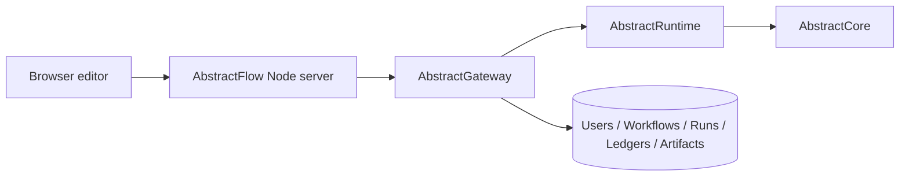

# Architecture

AbstractFlow is the web authoring surface for VisualFlow workflows.

## Product Boundary

AbstractFlow owns:

- the React/Vite visual editor in `src/`
- the npm CLI/static server and Gateway proxy in `bin/cli.js`
- browser-session UX for connecting to a Gateway user
- client-side mapping of Gateway discovery, run ledgers, artifacts, and media catalogs into editor controls
- VisualFlow authoring UX for node pin defaults, including inline JSON Schema response schemas on unconnected schema pins
- the right-drawer Workflow Authoring Assistant, including its Gateway-routed model call and validated draft-graph command reducer
- sample VisualFlow JSON files in `examples/flows/`

AbstractFlow delegates:

- user and role management to AbstractGateway
- provider credentials, endpoint profiles, and model defaults to AbstractGateway
- VisualFlow persistence and publish lifecycle to AbstractGateway
- run execution, waits, ledgers, artifacts, and runtime isolation to AbstractGateway/AbstractRuntime
- VisualFlow compilation and `.flow` bundle semantics to AbstractRuntime
- provider calls and capability plugins to AbstractCore through Gateway/Runtime

Flow authors schemas; it does not enforce model responses. Gateway persists and
publishes the VisualFlow JSON. Runtime applies unconnected `pinDefaults` and
normalizes structured-output schemas. Core/provider integrations enforce the
schema for the actual model call when supported.

The Workflow Authoring Assistant is an editor feature, not a runtime. It
resolves Gateway's default `output.text` route unless the user pins a specific
assistant provider/model, then starts a Gateway `basic-agent` planner run and
reads the terminal authoring response from the run ledger. The planner run
explicitly receives an empty runtime tool list so authoring edits are returned
as a workflow document JSON instead of Gateway tool calls. Generated content is
never applied as raw VisualFlow JSON: the emitted document is diffed against
the current graph in the browser and compiled into validated graph edits, and
Save/Publish/Run remain user-controlled Gateway operations.

## Runtime Shape



Flow serves static assets and proxies HTTP/SSE calls. The browser does not talk directly to provider APIs or runtime stores.

## Repository Layout

```
bin/                  npm CLI and Gateway proxy
src/                  React editor source
examples/flows/       sample VisualFlow JSON files
docs/                 user and contributor docs
package.json          npm package manifest
```

There is intentionally no Python package, no FastAPI host, and no local execution server in this repository.

## Auth Boundary

The Flow connection form collects a Gateway URL, Gateway user id, and Gateway user token. The Node proxy validates/exchanges that token with Gateway and stores only opaque browser-session cookies. Mutating proxy calls carry the Gateway CSRF token.

Hosted Flow deployments block arbitrary browser-supplied Gateway URLs by default so the Flow server cannot become a user-directed same-origin proxy.

## Discovery Boundary

Flow must discover capabilities from Gateway instead of hardcoding local providers. That includes:

- text/model providers
- OpenAI-compatible endpoint profiles
- media providers and task-specific model lists
- tool inventory and approval policy
- workspace and artifact affordances

Provider secrets stay in Gateway.

## Authoring Assistant Boundary

The assistant reads `docs/workflow-authoring-skill.md` bundled with the web app
plus a complete generated node catalog from `src/types/nodes.ts`. This
authoring skill replaces generic `llms-full.txt` context for graph
construction. The UI shows the prompt size it will send to Gateway and displays
the selected model's context/output limits from Gateway model-capability
discovery when available. AbstractFlow does not hardcode model context windows
or clip chat, skill docs, or graph context. The planner is invoked through
Gateway's normal run lifecycle, not the console sandbox.

The assistant is an iterative Flow-owned authoring controller using direct
document authoring. Each turn can run multiple Gateway planner runs: the model
emits the complete workflow document, the editor diffs it against the current
graph and applies the compiled changes through the validated command reducer,
recomputes preflight/readiness issues, and continues until the graph is ready
or explicitly blocked. Nodes and edges omitted from the document are deleted
(removal is implicit; deletions remain undoable via Undo Turn). Research,
news, job-search, and deep-research requests are checked for a multi-step
scaffold: start inputs, prompt building, explicit tools, an Agent with the
standard `max_iterations=50` setting, and end outputs.

Model output is restricted to the document JSON. The editor refuses changes
that would embed secrets, create unknown templates, bypass connection
validation, enable Code `full_access`, or create Tool Calls without an
explicit allowlist; secrets in the serialized document are redacted before
they reach the model. Tool-dependent authoring uses only Gateway's advertised
tool inventory and exact discovered tool names. The assistant has no local
template planner: if Gateway defaults, advertised discovery endpoints, the
planner run, JSON parsing, or document validation fail, the drawer surfaces the error instead
of synthesizing a substitute workflow.

## Defaults And Residency

Provider/model pins in saved workflows are optional. A blank provider/model
means `Auto (Gateway default)` and resolves through the current Gateway/Core
capability route at run time. This keeps portable workflows independent of a
specific deployment's OpenAI, Anthropic, LM Studio, Ollama, or endpoint-profile
setup.

The Model Residency modal is intentionally loaded-state only. It lists
provider-reported resident models and does not edit capability defaults.
Gateway Console and the Core/Gateway config CLIs own default route
configuration.
