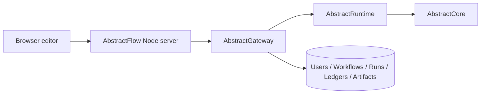

# Architecture

AbstractFlow is the web authoring surface for VisualFlow workflows.

## Product Boundary

AbstractFlow owns:

- the React/Vite visual editor in `src/`
- the npm CLI/static server and Gateway proxy in `bin/cli.js`
- browser-session UX for connecting to a Gateway user
- client-side mapping of Gateway discovery, run ledgers, artifacts, and media catalogs into editor controls
- sample VisualFlow JSON files in `examples/flows/`

AbstractFlow delegates:

- user and role management to AbstractGateway
- provider credentials, endpoint profiles, and model defaults to AbstractGateway
- VisualFlow persistence and publish lifecycle to AbstractGateway
- run execution, waits, ledgers, artifacts, and runtime isolation to AbstractGateway/AbstractRuntime
- VisualFlow compilation and `.flow` bundle semantics to AbstractRuntime
- provider calls and capability plugins to AbstractCore through Gateway/Runtime

## Runtime Shape



Flow serves static assets and proxies HTTP/SSE calls. The browser does not talk directly to provider APIs or runtime stores.

## Repository Layout

```
bin/                  npm CLI and Gateway proxy
src/                  React editor source
examples/flows/       sample VisualFlow JSON files
docs/                 user and maintainer docs
package.json          npm package manifest
```

There is intentionally no Python package, no FastAPI host, and no local execution server in this repository.

## Auth Boundary

The Flow connection form collects a Gateway URL, Gateway user id, and Gateway user token. The Node proxy validates/exchanges that token with Gateway and stores only opaque browser-session cookies. Mutating proxy calls carry the Gateway CSRF token.

Hosted Flow deployments block arbitrary browser-supplied Gateway URLs by default so the Flow server cannot become a user-directed same-origin proxy.

## Discovery Boundary

Flow must discover capabilities from Gateway instead of hardcoding local providers. That includes:

- text/model providers
- OpenAI-compatible endpoint profiles
- media providers and task-specific model lists
- tool inventory and approval policy
- workspace and artifact affordances

Provider secrets stay in Gateway.

## Defaults And Residency

Provider/model pins in saved workflows are optional. A blank provider/model
means `Auto (Gateway default)` and resolves through the current Gateway/Core
capability route at run time. This keeps portable workflows independent of a
specific deployment's OpenAI, Anthropic, LM Studio, Ollama, or endpoint-profile
setup.

The Model Residency modal is intentionally loaded-state only. It lists
provider-reported resident models and does not edit capability defaults.
Gateway Console and the Core/Gateway config CLIs own default route
configuration.
