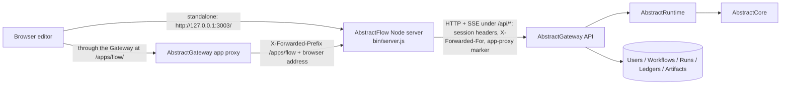
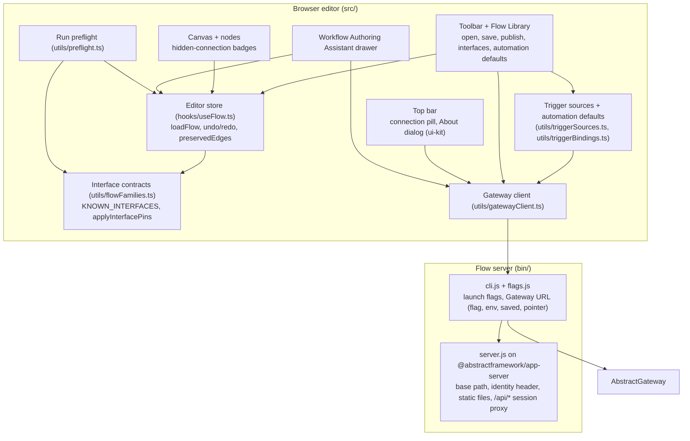
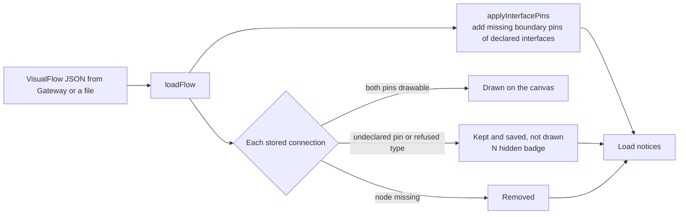
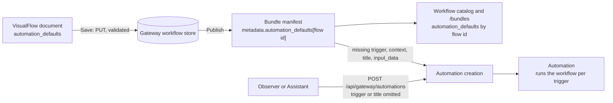

# Architecture

AbstractFlow is the web authoring surface for VisualFlow workflows.

## Product Boundary

AbstractFlow owns:

- the React/Vite visual editor in `src/`
- the npm CLI/static server and Gateway proxy in `bin/cli.js`
- browser-session UX for connecting to a Gateway user
- client-side mapping of Gateway discovery, run ledgers, artifacts, and media catalogs into editor controls
- VisualFlow authoring UX for node pin defaults, including inline JSON Schema response schemas on unconnected schema pins
- the right-drawer Workflow Authoring Assistant, including its Gateway-routed model call and validated draft-graph command reducer
- sample VisualFlow JSON files in `examples/flows/`

AbstractFlow delegates:

- user and role management to AbstractGateway
- provider credentials, endpoint profiles, and model defaults to AbstractGateway
- VisualFlow persistence and publish lifecycle to AbstractGateway
- run execution, waits, ledgers, artifacts, and runtime isolation to AbstractGateway/AbstractRuntime
- VisualFlow compilation and `.flow` bundle semantics to AbstractRuntime
- provider calls and capability plugins to AbstractCore through Gateway/Runtime

Flow authors schemas; it does not enforce model responses. Gateway persists and
publishes the VisualFlow JSON. Runtime applies unconnected `pinDefaults` and
normalizes structured-output schemas. Core/provider integrations enforce the
schema for the actual model call when supported.

The Workflow Authoring Assistant is an editor feature, not a runtime. It
resolves Gateway's default `output.text` route unless the user pins a specific
assistant provider/model, then starts a Gateway `basic-agent` planner run and
reads the terminal authoring response from the run ledger. The planner run
explicitly receives an empty runtime tool list so authoring edits are returned
as a workflow document JSON instead of Gateway tool calls. Generated content is
never applied as raw VisualFlow JSON: the emitted document is diffed against
the current graph in the browser and compiled into validated graph edits, and
Save/Publish/Run remain user-controlled Gateway operations.

## Runtime Shape


```mermaid
flowchart LR
  Browser[Browser editor] -->|"standalone: http://127.0.0.1:3003/"| Flow[AbstractFlow Node server<br/>bin/server.js]
  Browser -->|"through the Gateway at /apps/flow/"| GwProxy[AbstractGateway app proxy]
  GwProxy -->|"X-Forwarded-Prefix /apps/flow + browser address"| Flow
  Flow -->|"HTTP + SSE under /api/*: session headers, X-Forwarded-For, app-proxy marker"| Gateway[AbstractGateway API]
  Gateway --> Runtime[AbstractRuntime]
  Runtime --> Core[AbstractCore]
  Gateway --> Stores[(Users / Workflows / Runs / Ledgers / Artifacts)]
```

Flow serves the built editor and forwards HTTP and SSE calls under `/api/*`. The same server runs on its own at `/` or behind the Gateway at `/apps/flow/`; the editor uses relative URLs, so it works at either address. The browser does not talk directly to provider APIs or runtime stores. See [API and contracts > Serving Under A Base Path](api.md#serving-under-a-base-path).

## Components


```mermaid
flowchart TB
  subgraph Browser["Browser editor (src/)"]
    TopBar["Top bar<br/>connection pill, About dialog (ui-kit)"]
    Toolbar["Toolbar + Flow Library<br/>open, save, publish, interfaces, automation defaults"]
    Canvas["Canvas + nodes<br/>hidden-connection badges"]
    Store["Editor store (hooks/useFlow.ts)<br/>loadFlow, undo/redo, preservedEdges"]
    Interfaces["Interface contracts (utils/flowFamilies.ts)<br/>KNOWN_INTERFACES, applyInterfacePins"]
    Preflight["Run preflight (utils/preflight.ts)"]
    Triggers["Trigger sources + automation defaults<br/>(utils/triggerSources.ts, utils/triggerBindings.ts)"]
    Assistant["Workflow Authoring Assistant drawer"]
    Client["Gateway client (utils/gatewayClient.ts)"]
  end
  subgraph Server["Flow server (bin/)"]
    Cli["cli.js + flags.js<br/>launch flags, Gateway URL (flag, env, saved, pointer)"]
    Fwd["server.js on @abstractframework/app-server<br/>base path, identity header, static files, /api/* session proxy"]
  end
  Gateway[AbstractGateway]

  Toolbar --> Store
  Canvas --> Store
  Assistant --> Store
  Store --> Interfaces
  Preflight --> Interfaces
  Preflight --> Store
  Toolbar --> Triggers
  Triggers --> Client
  Toolbar --> Client
  TopBar --> Client
  Assistant --> Client
  Client --> Cli
  Cli --> Fwd
  Cli --> Gateway
```

## Opening A Workflow

Every way a document enters the editor (open, duplicate, rename-copy, file
import) goes through the store's `loadFlow`, which never discards a stored
connection silently:


```mermaid
flowchart LR
  Doc[VisualFlow JSON from Gateway or a file] --> Load[loadFlow]
  Load --> Pins["applyInterfacePins<br/>add missing boundary pins of declared interfaces"]
  Load --> Edges{Each stored connection}
  Edges -->|both pins drawable| Drawn[Drawn on the canvas]
  Edges -->|undeclared pin or refused type| Kept["Kept and saved, not drawn<br/>N hidden badge"]
  Edges -->|node missing| Dropped[Removed]
  Pins --> Notice[Load notices]
  Kept --> Notice
  Dropped --> Notice
```

Pins added on open are compared against the document as stored, so the
workflow shows unsaved changes until you save it. See
[Web editor > Hidden Connections](web-editor.md#hidden-connections) and
[VisualFlow JSON > Interfaces](visualflow.md#interfaces).

## Workflow Interfaces

A workflow's top-level `interfaces` list declares the contracts it implements.
The known interfaces and their typed boundary pins live in
`src/utils/flowFamilies.ts`. Eight of them carry pin contracts
(`abstractcode.agent.v1`, `abstractassistant.agent.v1`,
`abstractcode.goal.v1`, `abstractcode.coding.v1`,
`abstractresearch.coscientist.v1`, `abstractreview.adversarial.v1`,
`abstractextract.structured.v1`, `abstractbatch.mapreduce.v1`); two are
family markers without pins (`abstractresearch.deep.v1`,
`abstractmeta.intelligence.v1`). Entry-point interfaces make a workflow
executable by hosts.

The same contract is applied in four places: when interfaces are declared
(one undo step), when a workflow is opened, when an `On Flow Start` or
`On Flow End` node is added, and when the authoring assistant sets interfaces.
Existing pins are never removed, retyped, or reordered. Run preflight reports
missing pins, unconnected required `On Flow End` pins, and type mismatches as
warnings; the workflow still runs.

When the Flow Library changes the name, description, interfaces, or automation defaults of the
workflow open in the editor, the change is applied to that document only if it
is still the open one, so unsaved edits and undo history are kept.

## Automation Defaults

A runnable workflow can carry `automation_defaults`: what an automation created
from it starts with (trigger source and settings, context mode, title, default
`input_data`). Flow authors the field; Gateway stores, publishes and applies it;
Runtime owns the trigger sources and runs the automation.


```mermaid
flowchart LR
  Doc["VisualFlow document<br/>automation_defaults"] -->|Save: PUT, validated| Store[(Gateway workflow store)]
  Store -->|Publish| Manifest["Bundle manifest<br/>metadata.automation_defaults[flow id]"]
  Manifest --> Catalog["Workflow catalog and /bundles<br/>automation_defaults by flow id"]
  App["Observer or Assistant"] -->|POST /api/gateway/automations<br/>trigger or title omitted| Create[Automation creation]
  Manifest -->|missing trigger, context, title, input_data| Create
  Create --> Automation["Automation<br/>runs the workflow per trigger"]
```

- **Discovery** (`src/utils/triggerSources.ts`): the trigger sources come from
  the Gateway (the `trigger_sources_endpoint` advertised in the capabilities,
  else `GET /api/gateway/trigger-sources`). Flow keeps no local list, so a
  trigger source added to the Runtime registry appears in the editor without a
  Flow change. Answers are cached per Gateway URL; **Refresh sources**
  re-fetches.
- **Validation** (`src/utils/triggerBindings.ts`): the field's shape is
  checked (unknown keys refused, so no automation id or credential is stored in
  a workflow), then the trigger settings are checked against the source's
  `config_schema` using a JSON Schema subset. A schema that uses a keyword
  outside the subset is refused rather than partly checked.
- **Editing** (`src/components/AutomationDefaultsModal.tsx`): the settings form
  is built from the source's schema; saving is a `PUT` whose answer must echo
  the stored field.
- **Gateway**: validates the field again on save, exports it on publish as
  `metadata.automation_defaults[<flow id>]`, and fills a creation request's
  missing trigger, context, title and `input_data` from it.

The `On Schedule`, `On Event` and `Delay` nodes are unrelated to this path:
they wait inside a run that has already started. See
[Web editor > Automation Defaults](web-editor.md#automation-defaults) and
[VisualFlow JSON > Automation Defaults](visualflow.md#automation-defaults).

## Repository Layout

```
bin/                  npm CLI, Gateway proxy, forwarding headers
src/                  React editor source
examples/flows/       sample and shipped VisualFlow JSON files
scripts/              workflow generators, bundle packers, doc generators
test/                 server-level tests (unit tests sit next to src/ modules)
docs/                 user and contributor docs
package.json          npm package manifest
```

There is intentionally no Python package, no FastAPI host, and no local execution server in this repository.

## Auth Boundary

The Flow connection form collects a Gateway URL, Gateway user id, and Gateway user token. The Node proxy validates/exchanges that token with Gateway and stores only opaque browser-session cookies. Mutating proxy calls carry the Gateway CSRF token.

Hosted Flow deployments block arbitrary browser-supplied Gateway URLs by default so the Flow server cannot become a user-directed same-origin proxy. That decision uses the address of the browser's connection, never the `Host` header.

Every request the Flow server sends to the Gateway carries `X-Forwarded-For`
set to the browser's address and
`X-AbstractFramework-App-Proxy: abstractflow`
(the `@abstractframework/app-server` session proxy). Browser-supplied forwarding headers never reach the Gateway,
so the Gateway can decide reliably whether a browser runs on its own machine.
See [API and contracts > Proxy Contract](api.md#proxy-contract).

## About Dialog

The top bar's About button uses the shared AbstractFramework About card
(`AfAboutDialog`, ui-kit 0.8.0). The AbstractFlow version is injected from
`package.json` at build time; the framework and gateway versions come from
`GET /api/gateway/about` when the dialog opens and are picked by the ui-kit
`aboutVersionsFromGateway` helper, the same way in every AbstractFramework app.
About never lists per-package versions.

## Audio Previews

Audio artifacts (the artifact player and the run modal's generated-audio card)
play in the ui-kit waveform player (`AfAudioPlayer`, ui-kit 0.8.0): play/pause,
a waveform you click, drag or arrow-key to seek, and elapsed / total time. Flow
fetches the bytes with its Gateway credentials and passes an object URL; when
the browser cannot decode the waveform the bars stay flat and the audio still
plays.

## Discovery Boundary

Flow must discover capabilities from Gateway instead of hardcoding local providers. That includes:

- text/model providers
- OpenAI-compatible endpoint profiles
- media providers and task-specific model lists
- tool inventory and approval policy
- workspace and artifact affordances
- automation trigger sources and their settings schemas

Provider secrets stay in Gateway.

## Authoring Assistant Boundary

The assistant reads `docs/workflow-authoring-skill.md` bundled with the web app
plus a complete generated node catalog from `src/types/nodes.ts`. This
authoring skill replaces generic `llms-full.txt` context for graph
construction. The UI shows the prompt size it will send to Gateway and displays
the selected model's context/output limits from Gateway model-capability
discovery when available. AbstractFlow does not hardcode model context windows
or clip chat, skill docs, or graph context. The planner is invoked through
Gateway's normal run lifecycle, not the console sandbox.

The assistant is an iterative Flow-owned authoring controller using direct
document authoring. Each turn can run multiple Gateway planner runs: the model
emits the complete workflow document, the editor diffs it against the current
graph and applies the compiled changes through the validated command reducer,
recomputes preflight/readiness issues, and continues until the graph is ready
or explicitly blocked. Nodes and edges omitted from the document are deleted
(removal is implicit; deletions remain undoable via Undo Turn). Research,
news, job-search, and deep-research requests are checked for a multi-step
scaffold: start inputs, prompt building, explicit tools, an Agent with an
explicit `max_iterations >= 50` budget (a deliberate workflow choice for deep
iterative work; the unset default is 20), and end outputs.

Model output is restricted to the document JSON. The editor refuses changes
that would embed secrets, create unknown templates, bypass connection
validation, enable Code `full_access`, or create Tool Calls without an
explicit allowlist; secrets in the serialized document are redacted before
they reach the model. Tool-dependent authoring uses only Gateway's advertised
tool inventory and exact discovered tool names. The assistant has no local
template planner: if Gateway defaults, advertised discovery endpoints, the
planner run, JSON parsing, or document validation fail, the drawer surfaces the error instead
of synthesizing a substitute workflow.

## Defaults And Residency

Provider/model pins in saved workflows are optional. A blank provider/model
means `Auto (Gateway default)` and resolves through the current Gateway/Core
capability route at run time. This keeps portable workflows independent of a
specific deployment's OpenAI, Anthropic, LM Studio, Ollama, or endpoint-profile
setup.

The Resources panel reads Gateway's model-residency rows
(`model_residency_row_v1`), host memory/GPU state, and session prompt-cache
listings, and issues load/unload/lock/unlock/context-estimate calls only
through endpoints Gateway advertises in its contracts. It does not edit
capability defaults. Gateway Console and the Core/Gateway config CLIs own
default route configuration.

## Related

- [API and contracts](api.md): CLI options, environment variables, proxy routes, and frontend modules.
- [VisualFlow JSON](visualflow.md): the document format the editor reads and writes.
- [Web editor](web-editor.md): the user-facing features built on these components.
- [Troubleshooting](troubleshooting.md): symptoms and fixes.
