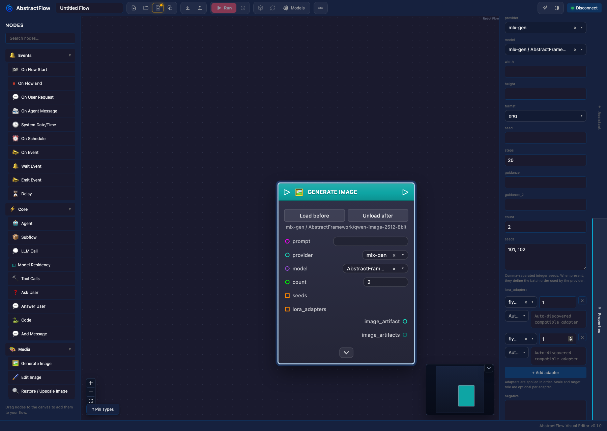

# Web Editor

AbstractFlow is the browser-based VisualFlow editor.

It talks to AbstractGateway for:

- user sessions and runtime routing
- workflow CRUD and publishing
- provider/model/capability discovery
- run start, commands, ledger replay, and ledger streaming
- artifacts, media previews, and generated output downloads

## Run With A Gateway

```bash
export ABSTRACTGATEWAY_USER_AUTH=1
export ABSTRACTGATEWAY_DATA_DIR="$PWD/runtime/gateway"
abstractgateway serve --host 127.0.0.1 --port 8080
```

```bash
npx @abstractframework/flow --gateway-url http://127.0.0.1:8080
```

Open http://localhost:3003.

## Browser Auth

Each browser signs in with a Gateway user id and that user's token. Flow exchanges the token with Gateway for an opaque browser session and keeps that session in HTTP-only cookies. Raw user tokens are not retained after sign-in.

Server/operator bearer tokens such as `ABSTRACTGATEWAY_AUTH_TOKEN` are not browser sign-in tokens. Use the Gateway user token, normally the bootstrap admin token for a first local install.

Remote browser-supplied Gateway URL changes are blocked by default. A hosted Flow instance should proxy only to its configured Gateway unless the operator explicitly enables `ABSTRACTFLOW_ALLOW_REMOTE_BROWSER_GATEWAY_CONFIG=1` behind their own access control.

## Provider And Model Discovery

Flow does not store API keys or endpoint secrets. It asks Gateway for provider catalogs, endpoint profiles, model lists, capability defaults, and media route descriptors.

Configure these in the Gateway console:

- OpenAI, Anthropic, OpenRouter, Portkey, Ollama, LM Studio
- custom OpenAI-compatible endpoint profiles
- Gateway-level and user-level capability defaults

Flow nodes then select providers and models from Gateway discovery.
Leave provider/model as **Auto (Gateway default)** when a workflow should use
the Gateway/Core capability route configured for the current runtime. This is
the portable default for LLM Call, Agent, and generated media nodes. If you pin
a provider and later want to return to runtime defaults, choose **Auto (Gateway
default)** again from the provider dropdown.

The Model Residency modal shows only provider-reported resident/loaded models.
Configure capability defaults in Gateway Console or with the Gateway/Core
config CLIs; changing a default does not load or unload a model.

## Workflow Authoring Assistant

The star button on the right side of the toolbar opens a conversational
assistant in the right drawer. The drawer shares space with Properties, so users
can switch between assistant guidance and node editing while keeping the canvas
visible.

The assistant uses `docs/workflow-authoring-skill.md` plus a complete generated
node catalog from `src/types/nodes.ts` as its graph-authoring context. This
replaces generic `llms-full.txt` context for workflow construction. By default
it resolves Gateway's configured `output.text` capability route and starts a
short-lived Gateway `basic-agent` planner run through the normal
`/api/gateway/runs/start` path. Users can pin a specific assistant
provider/model from the drawer. The assistant authors the workflow as one
complete JSON document (direct document authoring): each cycle the model emits
the full graph — every node and edge — and the editor diffs that document
against the current draft, compiles the diff into validated graph mutations,
applies them, and continues until the model declares the request satisfied or
is explicitly blocked. Anything the document omits is deleted, so removals are
implicit and the assistant never asks the user to delete nodes manually. The
first cycle aims to one-shot the workflow; later cycles exist to repair
validator errors, readiness issues, and acceptance findings.

Completion is model-owned: readiness checks are a structural floor that can
demand more work, but they never stop the loop while the model returns
`continue`. When the model declares `done` with clean readiness, the editor runs
an acceptance review — a second model pass that compares the draft graph against
the original request and the model's own declared acceptance criteria. Unmet
findings are fed back into the loop as issues; if the review budget is exhausted
the remaining findings are reported with the result instead of being hidden.

The planner run receives a single prompt plus a system prompt with strict JSON
instructions. Its runtime tool list is explicitly empty: authoring edits must
come back as the workflow document JSON, not as Gateway tool calls. Prior user turns
are included inside the current prompt, assistant turns are replayed as trimmed
plan/result summaries (so pending plan items survive across turns), and applied
cycles within a turn carry one-line notes of the model's own next steps. The
visible graph remains the source of applied draft state.

Session policy: one durable Gateway session per workflow conversation. The
session id is scoped to the workflow storage key (never shared across
workflows), follows a draft when it is promoted to a saved flow, and is
rotated by Clear Chat — so gateway-side agent memory restarts together with
the visible conversation. Because the gateway agent replays session memory
into the model context, the prompt anchors a language directive at the request
site and marks replayed conversation as historical, so the active request —
not session history in another language — controls the output language.

Plan responses are parsed tolerantly: the JSON object is extracted even when the
model wraps it in markdown fences or surrounding prose. A planner response that
is still unusable (empty run output, or truncated/invalid plan JSON) does not
abort the turn: the same cycle is retried with a corrective format note (bare
JSON only, shorten free-text fields rather than the graph document), up to
three unusable responses per turn. Each retry is logged in the activity feed.

A `continue` cycle whose document matches the existing graph exactly (no
changes) does not abort the turn either: the model gets a corrective note
(emit a document that addresses the issues, declare done, or ask the user) for
up to two consecutive unchanged cycles, after which the turn ends as "needs
your input" with the model's own reply — never as a hard authoring failure. The system
prompt and skill explicitly tell the model to return `needs_user` with concrete
questions when the request is ambiguous or repair cycles stop making progress;
the user's answer in the next turn resumes with the full draft graph and
conversation context. All user-visible workflow content (flow name, labels,
prompts, replies) must match the language of the user request unless the user
asks otherwise.

While a turn runs, a live status card shows the current phase with the cycle
number in the header, an elapsed timer, and a real-time activity feed (plan
request/response sizes, per-cycle token usage read from the Gateway run-tree
ledgers with cumulative turn totals in the footer, compiled document change
counts, applied changes with labels, document issues, retries, readiness
counts, and acceptance review events). A shimmering in-flight ticker pinned at
the bottom of the feed shows what the assistant is waiting on right now — the
request purpose ("authoring the full workflow document", "repairing 2
validation issues", "acceptance review") — with a per-stage elapsed counter
that ticks every second.
Feed entries are grouped under per-cycle divider rows so iteration boundaries
are scannable at a glance. The header carries a leading chevron with a hover
state (collapse toggle) and a copy button that exports the whole activity feed
— grouped by cycle, with elapsed timestamps — to the clipboard. The card
persists after the turn ends with its final state (green dot for "Draft graph
updated", red dot for "Authoring failed" or "Interrupted by user") so the
cycle history can be reviewed post-turn. A Stop control — in the status card
and in place of Send while busy — interrupts the autonomous loop between calls
and best-effort cancels the in-flight Gateway planner run; applied edits stay
in the draft and remain undoable via Undo Turn.

Conversation actions are compact icon buttons on the input row (copy
conversation, clear conversation, undo last turn) next to the Send/Stop button;
the estimated context usage appears above the model row while a request is
typed or running. AbstractFlow does not truncate the assistant conversation,
selected docs sections, or graph summary to fit a local limit, and it does not
hardcode model context windows. The drawer conversation and draft text are
persisted locally so closing and reopening the Assistant rail does not erase
the ongoing authoring discussion. Clear resets the local assistant
conversation, rotates the workflow's durable Gateway session, and clears the
persisted status card without changing the current graph. If the Gateway run, model call, structured
response, or ledger read fails after the retry budget, the drawer reports that
failure directly.

Assistant output is treated as an untrusted edit proposal. The emitted
document is compiled by a diff against the current graph into the editor's
internal validated command set (node creation/deletion, safe dynamic pins,
pin defaults, literals, Code node bodies, labels, concat separators, and
validated connections), so every existing validator and security guard stays
the single source of truth for graph mutation. The reducer rejects unknown
node types, invalid edges, secret-looking values, Code `full_access`, and Tool
Calls nodes without an explicit `allowed_tools` allowlist. Node deletions are
allowed as part of document ownership and remain recoverable with Undo Turn;
secrets are serialized to the model as `<redacted>` and the diff never writes
that sentinel back. `pin_defaults` merge per key, node ids are stable
identities (a type change requires a new id), existing node positions are
never moved, and new nodes without explicit positions get execution-depth
auto-layout.

Compiled changes are applied per-command in dependency order (nodes first, then
configuration, then connections, with disconnects before connects). Valid
changes are kept even when others fail; the failures are reported back to the
planner as document-issue feedback for the next cycle. The validator also
performs deterministic repairs that a human author would make: connecting an
already-connected execution output is rewired through an auto-inserted (or
extended) Sequence node, and loop-back edges from a loop body to the loop's
`exec-in` are dropped with a warning because AbstractRuntime control frames
return to the loop automatically when the body chain ends. Rejection messages
list the node's real pins so a wrong handle guess can be corrected on the next
cycle, and Variable nodes are configurable through the same document fields
used elsewhere (`pin_defaults` on `name`/`value`, or `literal` with the
declaration config). Unlabeled nodes are flagged as non-blocking notes so
generated graphs stay readable.

Research-oriented readiness checks require an authored Agent system prompt,
explicit tool configuration when web tools are needed, prompt-building nodes,
sources/citations that are not `Agent.meta`, an audit trace, and final outputs.
`Agent Trace Report` is accepted only for audit output, not as a report source.
These checks apply only when the request's deliverable is researched content
(deep research, internet/web research, news, digests, job search, or "research"
coupled to a workflow/report deliverable in the same sentence); an incidental
mention of "research" — such as "discussion, research, and deepening of ideas"
— does not force the research scaffold onto an unrelated workflow.
When a request asks for Markdown/PDF artifacts, the assistant must create
an executable `Write File` node for Markdown and an executable `Write PDF` node
for PDF. `Write PDF` renders report text or Markdown-style content to real PDF
bytes in Runtime and exposes the resulting path through `On Flow End`. Generic
`Write File` and sandbox Code are not treated as PDF generation.

Tool-dependent requests use Gateway's advertised tool inventory and exact tool
names. If Gateway defaults, advertised discovery endpoints, the planner run,
strict JSON parsing, or document validation fail, the assistant reports the error
instead of synthesizing a substitute plan. Completed cycle edits remain visible in
the draft; the failed cycle is not applied, and Undo Turn restores the pre-turn
snapshot.

Each assistant turn ends with how the draft works, how to test it, and what to
expect. The assistant changes the in-memory draft only. Users still review the
graph, Save, Publish, and Run through the normal Gateway-backed controls.

## Execution View

The toolbar's execution-view toggle (node-to-node arrow icon) condenses the
canvas to the control-flow skeleton. Only nodes linked by execution edges
remain visible, along with those edges; data-only nodes (literals, concat,
parsers) and data edges are hidden. Node positions are unchanged, so the
layout matches the full view when switching back and forth.

Each condensed node reuses the full-view node header — the same header color,
uppercase title, and sheen — so a node is instantly recognizable across both
modes. A family icon and silhouette add a second cue: events (pill), control
flow such as Sequence or If/Else (sharp corners, with named branch rows in the
dark node body), user interaction (speech-bubble corner), generative AI and
generated media (rounded), tools & files, memory, subflow (double border), and
logic/state. Runtime highlights (executing/recent) still apply in this view.

The execution view is a reading mode: dropping new palette nodes is blocked
with a hint, while moving nodes and rewiring execution pins remain available.

## Structured Output Schemas

LLM Call and Agent nodes expose `resp_schema` as an optional JSON Schema input.
When that input is not connected, the node shows an inline schema editor. The
Builder tab is for object fields, required/optional fields, descriptions, and
Choice fields. Choice fields are saved as standard JSON Schema string enums.

The JSON Schema tab accepts advanced object schemas directly, including `$ref`
schemas that Runtime can resolve. Switching back to Builder preserves supported
top-level fields and Choice values.

Connected schema inputs always override the inline default. When a workflow is
published, Gateway stores and packs the VisualFlow JSON unchanged; Runtime then
applies unconnected `pinDefaults.resp_schema` values and Core enforces the
structured output schema.

For branch routing, define a Choice field such as `choice`, wire the
LLM/Agent `data` output into Break Object, expose `choice`, and connect it to a
Switch node. `response` remains available as text for display and compatibility.
The Switch panel can sync explicit cases from the discovered enum values, so the
published workflow contains stable `switchConfig.cases`.

## Media Nodes

Flow exposes media nodes only when Gateway advertises the corresponding capability:

- Generate Image
- Edit Image / Image-to-Image
- Restore / Upscale Image
- Generate Video
- Image-to-Video
- Generate Voice
- Generate Music
- Transcribe Audio
- Listen Voice

Generated outputs are Gateway artifacts. The run modal renders image/video/audio previews and keeps the artifact content link available for open/download. When Gateway returns a media child run, Flow streams the child-run ledger and renders `abstract.progress` records for image, image-edit, image-upscale, video, and image-to-video runs when available.

Unconnected artifact input pins expose a browser upload affordance directly on the node. Uploads go to Gateway and are stored as session-visible artifacts, then the node stores the canonical artifact ref as its pin default. Flow does not use server workspace paths for browser-local uploads.

`Listen Voice` waits are handled as Gateway/Runtime waits. Flow only captures audio in the browser, uploads it to Gateway as an audio artifact, and resumes the waiting run with that artifact ref; transcription and downstream execution remain Gateway/Runtime work.

For the vision routes, the Properties drawer now follows the Gateway media
contract closely:

- `Generate Image`, `Edit Image`, `Generate Video`, and `Image To Video` expose
  task-filtered provider/model selectors backed by Gateway discovery.
- Compatible routes expose batch controls through `count` and ordered `seeds`.
- Compatible routes expose ordered `lora_adapters` stacks with per-adapter
  scale and optional target role.
- Batched routes surface plural artifact outputs such as `image_artifacts` and
  `video_artifacts` alongside the singular compatibility pins.

Flow only shows those editors when the current node contract advertises the
corresponding support. Provider/model selection remains optional; leaving them
on `Auto (Gateway default)` keeps the workflow portable across runtimes and
users.



## Files, folders, and artifacts

Flow uses one explicit source model for file-like work:

- `Artifact`: a saved Runtime-owned payload that can be reused across runs.
- `Local File`: a browser upload from this computer. For artifact-style inputs,
  Flow uploads it to Gateway and stores the resulting artifact ref.
- `Local Folder`: a browser-selected folder from this computer. In hosted
  Flow, each file is uploaded to Gateway and the workflow receives an ordered
  multi-artifact input with preserved relative member paths.
- `Server File` / `Server Folder`: a file or folder inside the active Gateway
  workspace scope. The underlying engineering contract is a canonical
  `Workspace File` / `Workspace Folder` path such as `docs/report.md` or
  `mount_alias/reports`.

The run modal and node defaults now expose workspace path browsing for
`Workspace File` / `Workspace Folder` pins, plus artifact-backed local intake
for one file, many files, or one or more local folders. Typical graph patterns are:

- `List Folder Files` to enumerate a workspace-scoped server folder with family
  and extension filters.
- `Import Server File` to snapshot a server file into a durable artifact.
- `Read Artifact` to inspect text, JSON, or bounded binary projections from any
  artifact-backed file.
- `Read Artifact` -> `content_family` / `content_type` -> `Switch` to route
  image, audio, text, PDF, or other file inputs through different subgraphs.
- `Export Artifact` to write a durable artifact back into the current server
  workspace.
- `ForEach` / array nodes over an `array<file>` input to analyze local files or
  local-folder contents file by file. `Local Folder` in the run form is a
  source for `array<file>`, so the workflow still receives files with
  preserved relative member paths rather than a live folder path.

## Development

```bash
npm install
npm run dev
```

Useful environment variables:

- `ABSTRACTGATEWAY_URL` or `ABSTRACTFLOW_GATEWAY_URL`: default Gateway target for the proxy.
- `ABSTRACTFLOW_ALLOW_REMOTE_BROWSER_GATEWAY_CONFIG=1`: allow non-local browsers to change the Gateway URL.
- `ABSTRACTFLOW_TRUST_PROXY_HEADERS=1`: honor forwarded host/proto headers behind a trusted reverse proxy.

## Build And Serve

```bash
npm run build
npm start -- --host 0.0.0.0 --port 3003 --gateway-url http://127.0.0.1:8080
```
