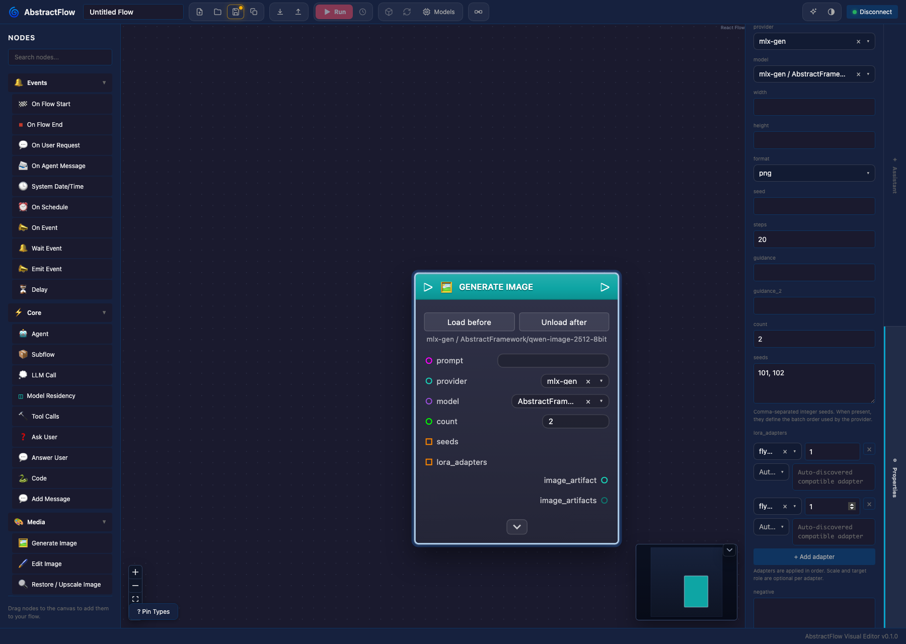

# Web Editor

AbstractFlow is the browser-based VisualFlow editor.

It talks to AbstractGateway for:

- user sessions and runtime routing
- workflow CRUD and publishing
- provider/model/capability discovery
- run start, commands, ledger replay, and ledger streaming
- artifacts, media previews, and generated output downloads

## Run With A Gateway

```bash
export ABSTRACTGATEWAY_USER_AUTH=1
export ABSTRACTGATEWAY_DATA_DIR="$PWD/runtime/gateway"
abstractgateway serve --host 127.0.0.1 --port 8080
```

```bash
npx @abstractframework/flow --gateway-url http://127.0.0.1:8080
```

Open http://127.0.0.1:3003/.

## Browser Auth

Each browser signs in with a Gateway user id and that user's token. Flow exchanges the token with Gateway for an opaque browser session and keeps that session in HTTP-only cookies. Raw user tokens are not retained after sign-in.

Server/operator bearer tokens such as `ABSTRACTGATEWAY_AUTH_TOKEN` are not browser sign-in tokens. Use the Gateway user token, normally the bootstrap admin token for a first local install.

Remote browser-supplied Gateway URL changes are blocked by default. A hosted Flow instance should proxy only to its configured Gateway unless the operator explicitly enables `ABSTRACTFLOW_ALLOW_REMOTE_BROWSER_GATEWAY_CONFIG=1` behind their own access control.

Every request the Flow server sends to the Gateway carries `X-Forwarded-For` set to the browser's address and `X-AbstractFramework-App-Proxy: abstractflow`. The Gateway uses them to tell whether the browser runs on its own computer. Behind the Gateway at `/apps/flow/`, the browser's address is the one the Gateway forwarded; forwarding headers are believed only from a connection on the Flow server's own computer, and browser-supplied ones never reach the Gateway. The Vite development server (`npm run dev`) uses the same session proxy. See [Troubleshooting](troubleshooting.md#sign-in-and-connection) for sign-in and proxy errors.

Opened through the Gateway (**Apps > Flow Editor > Open** in the Gateway console), the editor lives at `/apps/flow/` and the browser arrives signed in. The session cookies there belong to `/apps/flow/` only. See [API and contracts > Serving Under A Base Path](api.md#serving-under-a-base-path).

## Open A Gateway Workflow From A Link

The Gateway console's **Workflows** page has an **Open** button (tooltip "Open in AbstractFlow") on every workflow. It opens the editor at:

```text
/apps/flow/?bundle=<bundle_id>&version=<bundle_version>[&flow=<flow_id>]
```

- `bundle` (required): the workflow id, as listed on the Workflows page.
- `version`: the bundle version. Without it, Flow opens the latest version the Gateway serves.
- `flow`: one flow inside the bundle. Without it, Flow opens the bundle's default entry point.

Once signed in, Flow reads the bundle from the Gateway (`GET /api/gateway/bundles/{bundle_id}?bundle_version=` and `GET /api/gateway/bundles/{bundle_id}/flows/{flow_id}?bundle_version=`) and opens it:

- If the bundle was published from a flow you still have (its `metadata.source.root_flow_id` is one of your flows), Flow opens that flow. Save updates it, as usual.
- Otherwise Flow opens the bundle's flow as an unsaved copy titled `<name> · <bundle_id>@<version>`. Save creates your own flow. Nothing is ever written back into the bundle.
- A workflow that ships with the Gateway shows the notice "Shipped workflow — read-only. Save creates your own copy."

While the flow loads (from a link or from **Open**), a loading screen covers the editor with the flow's name and **Cancel**. Cancel (or Esc) stops the requests to the Gateway; the editor keeps the flow it had and says so.

If the workflow cannot be opened, Flow says why: "This workflow isn't on this gateway any more." when the Gateway no longer has it, the Gateway's own reason when it refuses (for example a workflow an admin made unavailable to users), and "Sign in to the gateway to open …" when the session is missing. The link is read once per page load; reloading the page opens the workflow again.

## About

The About button (the `i` icon in the top-right cluster, between Appearance and the connection pill) opens the AbstractFramework About card: the AbstractFlow version, the AbstractFramework and AbstractGateway versions, links to the website, source, docs, issues, feedback and contact, and one author/licence line. When the card opens, Flow asks the connected gateway for its versions (`GET /api/gateway/about`); it shows only the framework and gateway versions, never a package list. If that request fails, the AbstractGateway line reads `unavailable (...)` with the HTTP status or error.

## Responsive Layout

The editor works on a desktop window, a laptop, a tablet, a phone, and a
browser window at any size. The canvas always fills the space between the
header and the bottom of the screen. The side panels change behaviour with
the window width:

| Window | Node palette | Properties, assistant, functions | Dialogs |
|---|---|---|---|
| 1024 px and wider | Docked on the left | Docked on the right, opened from the rail or by selecting a node | Centered |
| 768-1023 px (tablet portrait, narrow window) | Drawer from the left, opened with the palette button at the left of the header | Drawer over the canvas; the rail stays on the right edge | Centered, with a margin around them |
| Below 768 px, or below 500 px tall (phones) | Full-width drawer on phones in portrait | Full-width drawer on phones in portrait | Bottom sheets with the action row pinned at the bottom |

- **Drawers.** Only one drawer is open at a time. Close it with Escape, its ×
  button, or a tap on the dimmed canvas. Selecting a node opens its
  properties.
- **Changing the window size.** When the window narrows below 1024 px, the
  open panels close so the canvas stays visible. When it widens again, the
  panel that was open is docked again.
- **Header.** Between 1024 and 1439 px the toolbar scrolls sideways within
  its row. Below 768 px the header has two rows: the palette button, flow name
  and top-bar buttons, then the toolbar, with Run first.
- **Adding nodes on a touch screen.** Touch screens have no drag-and-drop. Tap
  a node in the palette to add it at the centre of the visible canvas; the
  palette closes so you can see it. The same tap works whenever the palette is
  a drawer. On a desktop with a mouse, drag nodes from the palette as usual.
- **Canvas.** Pinch to zoom and drag to pan. The zoom controls are 44 px on
  touch screens. The minimap starts collapsed on phones and short screens;
  use the toggle in the bottom-right corner to show it. The view fits the
  flow again when you rotate the device.
- **Flow library and run window on phones and tablets.** Below 1024 px the
  library shows the flow list above the preview (side by side in phone
  landscape), and the run window shows the execution steps above the step
  details. Each sheet scrolls as one page; the lists do not scroll inside
  their own box. Sections are flat, with a thin line between items. The
  list's header (**Flows**, **Execution**) hides or shows the list with a
  tap, a click, Enter or Space; lists start open and the editor remembers
  your choice in this browser. On phones the run window uses the width of
  the screen with a 12 px margin, and label and value share a line when they
  fit.
- **Side panel tabs on phones.** The Assistant, Properties and Functions tabs
  sit in a row at the top of the drawer, so the open panel uses the full
  width.
- **On-screen keyboard.** The assistant composer and the sheets' action rows,
  such as the library's Load button, stay above the keyboard. In phone
  landscape a 200 px keyboard leaves room for the composer; a taller keyboard
  leaves less space than the composer needs.
- **Touch targets and text.** Toolbar buttons, palette nodes, library rows,
  selects and dialog buttons are at least 44 px on touch screens. Text on
  touch screens uses a larger scale: body text 14 to 15 px, secondary text
  13 px. Inputs use 16 px text so iOS does not zoom in when you focus them.
  Your font-size setting multiplies every size.
- **Notifications** appear at the top of the screen on phones, clear of the
  sheets' action rows, and at the bottom right elsewhere.

What stays desktop-sized: node cards and the controls inside them (pin
inputs, pin selects, "Edit Code") keep their compact design and scale with
the canvas zoom, so zoom in to work on them on a small screen. On a desktop
with a mouse, the panels keep their dense layout with text at 12 px or more
(secondary text 13 px).

## Switches

On/off settings are switches labelled by what they control; a switch is
highlighted with a check mark when on and plain when off. The properties
panel has **Structured output** (Agent), **Recurrent** (On Schedule) and
**Free text answers** (Ask User). The dialogs have **Reload gateway bundles**
(Publish), **New folder per run** (the run window's workspace folder),
**Durable** (sending an event to a waiting run), and **Lock after load** and
**Cached and non-resident models** (Resources). When a switch cannot change,
it says why next to it: **New folder per run** is fixed while the gateway
manages the workspace or a run is in progress. Pause and Resume on a running
run are buttons, because they act on the run once.

## Provider And Model Discovery

Flow does not store API keys or endpoint secrets. It asks Gateway for provider catalogs, endpoint profiles, model lists, capability defaults, and media route descriptors.

Configure these in the Gateway console:

- OpenAI, Anthropic, OpenRouter, Portkey, Ollama, LM Studio
- custom OpenAI-compatible endpoint profiles
- Gateway-level and user-level capability defaults

Flow nodes then select providers and models from Gateway discovery.
Leave provider/model as **Auto (Gateway default)** when a workflow should use
the Gateway/Core capability route configured for the current runtime. This is
the portable default for LLM Call, Agent, and generated media nodes. If you pin
a provider and later want to return to runtime defaults, choose **Auto (Gateway
default)** again from the provider dropdown.

## Resources

The toolbar's **Resources** button opens the Resources panel, which reads
Gateway's model-residency, host-state, and session-cache endpoints across
three tabs:

- **Models** lists the models Gateway reports for the current runtime: a
  modality chip (colored from Gateway's `modality_ui` contract), provider,
  model, a tri-state Resident pill (Yes / No / Unknown), size, and context
  length (✓ marks a calibrated value). Locked models carry a lock marker;
  Lock/Unlock and a per-model context Estimate appear when Gateway advertises
  those endpoints. Unloading a locked model asks for an explicit Force Unload
  confirmation. The **Cached and non-resident models** switch reveals cached
  and configuration-only rows, and the load bar's **Lock after load** switch
  locks a model as part of loading it.
- **Memory** shows host RAM, device, and per-GPU meters, process RSS, and
  degraded-state reasons from Gateway host state, refreshed every 5 seconds
  while the tab is open.
- **Session caches** lists per-session prompt caches and clears a session's
  caches after confirmation.

The panel manages loaded models; it does not edit capability defaults.
Configure capability defaults in Gateway Console or with the Gateway/Core
config CLIs; changing a default does not load or unload a model.

## Flow Interfaces

Open the **Flow Library**, select a workflow and use the edit button next to **Interfaces** to declare the contracts it implements (for example **Runnable agent (v1)** for AbstractCode). The editor lists the typed pins each selected interface requires. Saving adds the missing ones to the `On Flow Start` and `On Flow End` nodes: right away when the workflow is open in the editor (your unsaved edits and undo history are kept, and the flow shows unsaved changes until you **Save**), otherwise the next time you open it. Wire the added pins on the canvas so hosts get real values. See [VisualFlow JSON > Interfaces](visualflow.md#interfaces) for the pins of every interface.

## Automation Defaults

An automation runs a published workflow again and again: on a fixed interval, once at a given time, or only when you ask. You create and manage automations in AbstractObserver or the Assistant. The editor stores what an automation created from a workflow starts with, in the workflow's `automation_defaults` field.

Open the **Flow Library** and select a workflow. The **Automation** row summarizes its defaults (for example `Schedule v1 · every 5m · growing context`). The edit button next to it is offered for runnable workflows, those that declare an entry-point interface; a workflow without one shows "Declare a runnable interface first". The dialog has these fields:

- **Trigger**: the trigger sources your gateway serves. The gateway ships **Schedule** and **Manual**; trigger adapters installed on the gateway appear in the same list with no editor update, because the list and each source's settings form come from the gateway. A source the gateway lists but cannot load is shown disabled with its reason. **Refresh sources** asks the gateway again.
- **Settings**: a form built from the selected source's `config_schema`. For **Schedule**, `every` is a whole number of seconds, minutes, hours or days (for example 5 minutes or 24 hours), `start_at` and `until` are RFC 3339 timestamps, and `count` limits the number of runs. Schedules are fixed intervals in UTC; cron expressions are not supported. Without `every` the schedule fires once, at `start_at`. Leave a field empty to use the source's default. **Manual** has no settings.
- **Context**: *Independent* (every run starts fresh, the default) or *Growing* (every run continues the same conversation).
- **Title** (optional) and **Default input_data**: the inputs of the workflow's `On Flow Start` node, as a JSON object. When an automation runs, a text `prompt` is prefixed with a line naming the trigger and the run number.

**Save** checks the settings against the source, sends them to the gateway (`PUT` on the workflow), and confirms that the gateway's answer contains the stored defaults. When the gateway does not store the field, the dialog shows an error instead of reporting a save. **Remove defaults** clears the field. If the workflow is open in the editor, the change is applied to the open document and your unsaved edits are kept. **Save**, **Duplicate** and **Publish** carry the field with the workflow; see [VisualFlow JSON > Automation Defaults](visualflow.md#automation-defaults) for the stored shape and what the gateway does with it.

The dialog does not set tool approval. When an automation is created, the gateway applies its default policy, in which creating the automation counts as consent for the tools the workflow uses; a creation request that sets `policy.tool_approval` to `ask` makes every run wait for approval instead. Questions from `Ask User` nodes always wait for a person.

### Trigger-Source Discovery

The editor reads the discovery path from the gateway's capabilities (`contracts.common.automations.trigger_sources_endpoint`) and falls back to `GET /api/gateway/trigger-sources`. The answer is kept per gateway URL until you press **Refresh sources**; a failed request is not kept, so the next attempt asks again.

- When the capabilities report automations as unavailable, or the gateway does not serve the route (HTTP 404), the dialog shows that trigger sources are unavailable on this gateway.
- Any other failure, including an answer that does not match the trigger-source contract (`id`, `version`, `label`, `config_schema`, `event_schema`, `capabilities.kind` of `time`, `manual` or `event`, `available`), is shown as a discovery error.

### Settings Validation

The editor validates settings with a subset of JSON Schema: `type`, `properties`, `required`, `additionalProperties`, `enum`, `pattern`, `minimum`, `maximum`, `minLength`, `maxLength`, the formats `date-time` and `duration`, and the annotations `title`, `description`, `default`, `examples`, `$schema` and `$comment`. A source whose `config_schema` uses any other keyword or format cannot be checked in the editor: the dialog names each unsupported keyword and its path, and **Save** stays disabled for that source. A defaults object that names an unknown source, an unavailable source, or a version the gateway does not serve is refused with a message. The gateway validates the defaults again when you save and when an automation is created.

`On Schedule`, `On Event` and `Delay` (`wait_until`) are different: they wait inside a run that has already started and never start a workflow. See [Workflow node catalog](workflow-node-catalog.md).

## Hidden Connections

Some workflows wire pins the editor cannot draw: a code node's returned keys and a subflow's `child_output` are resolved by name when the workflow runs, but they are not declared pins, and a few connections (for example a model into a plain string pin) are refused by the editor's connection rules. AbstractFlow keeps these connections exactly as stored and saves them back. A node that has any shows an **N hidden** badge in its header; hover it to list the connections (`source.pin -> target.pin`). They disappear from the saved workflow only when you delete one of their nodes. Opening or importing such a workflow also shows a notice listing them. Only a connection to a node that does not exist is removed, and the notice says so. Drawing these connections as editable pins is planned (backlog 0157).

## Docs Assistant

The book icon in the top bar opens the **Docs assistant**: the same chat as the Gateway console and the other apps, separate from the Authoring assistant below. It answers questions about AbstractFlow from its llms.txt (the editor serves it at `/llms.txt`; the Gateway reads it at `GET /api/gateway/docs/corpus?app=flow`) through the Gateway's docs-qa workflow, in its own Gateway session. Questions sit on the right and answers on the left with Markdown, code and links; you can attach files, each message has **Copy**, the answer streams when the Gateway's **Streamed replies** setting is on, and the icon in its header starts a new conversation.

## Workflow Authoring Assistant

The star button on the right side of the toolbar opens a conversational
assistant in the right drawer. The drawer shares space with Properties, so users
can switch between assistant guidance and node editing while keeping the canvas
visible.

The assistant uses `docs/workflow-authoring-skill.md` plus a complete generated
node catalog from `src/types/nodes.ts` as its graph-authoring context. This
replaces generic `llms-full.txt` context for workflow construction. By default
it resolves Gateway's configured `output.text` capability route and starts a
short-lived Gateway `basic-agent` planner run through the normal
`/api/gateway/runs/start` path. Users can pin a specific assistant
provider/model from the drawer. The assistant authors the workflow as one
complete JSON document (direct document authoring): each cycle the model emits
the full graph — every node and edge — and the editor diffs that document
against the current draft, compiles the diff into validated graph mutations,
applies them, and continues until the model declares the request satisfied or
is explicitly blocked. Anything the document omits is deleted, so removals are
implicit and the assistant never asks the user to delete nodes manually. The
first cycle aims to one-shot the workflow; later cycles exist to repair
validator errors, readiness issues, and acceptance findings.

Completion is model-owned: readiness checks are a structural floor that can
demand more work, but they never stop the loop while the model returns
`continue`. When the model declares `done` with clean readiness, the editor runs
an acceptance review — a second model pass that compares the draft graph against
the original request and the model's own declared acceptance criteria. Unmet
findings are fed back into the loop as issues; if the review budget is exhausted
the remaining findings are reported with the result instead of being hidden.

The planner run receives a single prompt plus a system prompt with strict JSON
instructions. Its runtime tool list is explicitly empty: authoring edits must
come back as the workflow document JSON, not as Gateway tool calls. Prior turns
are included inside the current prompt through the history window: the newest
whole turns up to 50,000 estimated tokens (AbstractRuntime's rule, ADR-0026). No
turn is cut, so the pending items of a long plan survive across turns. The block
states how many turns it holds, and a labeled `#TRUNCATION` line gives the count
when older turns are dropped. Applied cycles within a turn carry one-line notes
of the model's own next steps. After a test run, the next cycle reads every
failed step with its whole inputs, the run's inputs and, on a pass, its whole
outputs. The visible graph remains the source of applied draft state.

Session policy (revised 2026-07-11, backlog 0112): the per-workflow session id
remains the conversation identity — scoped to the workflow storage key (never
shared across workflows), following a draft when it is promoted to a saved
flow, and rotated by Clear Chat — but planner runs are SESSIONLESS. The
gateway agent replays session memory into the model context; with a shared
session, cycle N re-billed cycles 1..N-1's prompts and responses even though
the client prompt already carries the conversation, cycle notes, and current
document explicitly. Session-carrying run starts also mint a persistent
session-memory owner run per new session server-side, so per-cycle derived
sessions would leave one orphan run per cycle — omitting the session id
avoids both. Continuity across turns lives in the client-persisted
conversation block. The prompt still anchors a language directive at the
request site and marks replayed conversation as historical, so the active
request — not history in another language — controls the output language.

Prompt placement is cache-first (backlog 0112): the large stable context
(authoring skill, node catalog, gateway tool schemas) is byte-identical
across cycles within a turn and rides the SYSTEM message — the runtime
prepends a volatile grounding envelope (with a second-resolution timestamp)
to every user prompt, so only system content can form a wire-stable prefix
for provider caches. The user prompt carries the volatile block
(conversation, authoring brief, current document, the active request).
Nothing is dropped — placement only (ADR-0026 forbids lossy compaction).

Plan responses are parsed tolerantly: the JSON object is extracted even when the
model wraps it in markdown fences or surrounding prose. A planner response that
is still unusable (empty run output, or truncated/invalid plan JSON) does not
abort the turn: the same cycle is retried with a corrective format note (bare
JSON only, shorten free-text fields rather than the graph document), up to
three unusable responses per turn. Each retry is logged in the activity feed.

A `continue` cycle whose document matches the existing graph exactly (no
changes) does not abort the turn either: the model gets a corrective note
(emit a document that addresses the issues, declare done, or ask the user) for
up to two consecutive unchanged cycles, after which the turn ends as "needs
your input" with the model's own reply — never as a hard authoring failure. The system
prompt and skill explicitly tell the model to return `needs_user` with concrete
questions when the request is ambiguous or repair cycles stop making progress;
the user's answer in the next turn resumes with the full draft graph and
conversation context. All user-visible workflow content (flow name, labels,
prompts, replies) must match the language of the user request unless the user
asks otherwise.

While a turn runs, a live status card shows the current phase with the cycle
number in the header, an elapsed timer, and a real-time activity feed (plan
request/response sizes, per-cycle token usage read from the Gateway run-tree
ledgers with cumulative turn totals in the footer, compiled document change
counts, applied changes with labels, document issues, retries, readiness
counts, and acceptance review events). A shimmering in-flight ticker pinned at
the bottom of the feed shows what the assistant is waiting on right now — the
request purpose ("authoring the full workflow document", "repairing 2
validation issues", "acceptance review") — with a per-stage elapsed counter
that ticks every second.
Feed entries are grouped under per-cycle divider rows so iteration boundaries
are scannable at a glance. The header carries a leading chevron with a hover
state (collapse toggle) and a copy button that exports the whole activity feed
— grouped by cycle, with elapsed timestamps — to the clipboard. The card
persists after the turn ends with its final state (green dot for "Draft graph
updated", red dot for "Authoring failed" or "Interrupted by user") so the
cycle history can be reviewed post-turn. A Stop control — in the status card
and in place of Send while busy — interrupts the autonomous loop between calls
and best-effort cancels the in-flight Gateway planner run; applied edits stay
in the draft and remain undoable via Undo Turn.

Conversation actions are compact icon buttons on the input row (copy
conversation, clear conversation, undo last turn) next to the Send/Stop button;
the estimated context usage appears above the model row while a request is
typed or running. AbstractFlow does not truncate the assistant conversation,
selected docs sections, or graph summary to fit a local limit, and it does not
hardcode model context windows. The drawer conversation and draft text are
persisted locally so closing and reopening the Assistant rail does not erase
the ongoing authoring discussion. Clear resets the local assistant
conversation, rotates the workflow's durable Gateway session, and clears the
persisted status card without changing the current graph. If the Gateway run, model call, structured
response, or ledger read fails after the retry budget, the drawer reports that
failure directly.

Assistant output is treated as an untrusted edit proposal. The emitted
document is compiled by a diff against the current graph into the editor's
internal validated command set (node creation/deletion, safe dynamic pins,
pin defaults, pin expressions, literals, Code node bodies, labels, concat
separators, and validated connections), so every existing validator and
security guard stays
the single source of truth for graph mutation. The reducer rejects unknown
node types, invalid edges, secret-looking values, Code `full_access`, and Tool
Calls nodes without an explicit `allowed_tools` allowlist. Node deletions are
allowed as part of document ownership and remain recoverable with Undo Turn;
secrets are serialized to the model as `<redacted>` and the diff never writes
that sentinel back. `pin_defaults` and `pin_expressions` merge per key (an
empty-string expression removes one), node ids are stable identities (a type
change requires a new id), existing node positions are never moved, and new
nodes without explicit positions get execution-depth auto-layout.

Compiled changes are applied per-command in dependency order (nodes first, then
configuration, then connections, with disconnects before connects). Valid
changes are kept even when others fail; the failures are reported back to the
planner as document-issue feedback for the next cycle. The validator also
performs deterministic repairs that a human author would make: connecting an
already-connected execution output is rewired through an auto-inserted (or
extended) Sequence node, and loop-back edges from a loop body to the loop's
`exec-in` are dropped with a warning because AbstractRuntime control frames
return to the loop automatically when the body chain ends. Rejection messages
list the node's real pins so a wrong handle guess can be corrected on the next
cycle, and Variable nodes are configurable through the same document fields
used elsewhere (`pin_defaults` on `name`/`value`, or `literal` with the
declaration config). Unlabeled nodes are flagged as non-blocking notes so
generated graphs stay readable.

Research-oriented readiness checks require an authored Agent system prompt,
explicit tool configuration when web tools are needed, prompt-building nodes,
sources/citations that are not `Agent.meta`, an audit trace, and final outputs.
`Agent Trace Report` is accepted only for audit output, not as a report source.
These checks apply only when the request's deliverable is researched content
(deep research, internet/web research, news, digests, job search, or "research"
coupled to a workflow/report deliverable in the same sentence); an incidental
mention of "research" — such as "discussion, research, and deepening of ideas"
— does not force the research scaffold onto an unrelated workflow.
When a request asks for Markdown/PDF/DOCX artifacts, the assistant must create
an executable `Write File` node for Markdown, an executable `Write PDF` node for
PDF, and an executable `Write DOCX` node for DOCX. `Write PDF` and `Write DOCX`
render report text or Markdown-style content to real document bytes in Runtime
and expose the resulting paths through `On Flow End`. Generic `Write File` and
sandbox Code are not treated as document generation.

Tool-dependent requests use Gateway's advertised tool inventory and exact tool
names. If Gateway defaults, advertised discovery endpoints, the planner run,
strict JSON parsing, or document validation fail, the assistant reports the error
instead of synthesizing a substitute plan. Completed cycle edits remain visible in
the draft; the failed cycle is not applied, and Undo Turn restores the pre-turn
snapshot.

Each assistant turn ends with how the draft works, how to test it, and what to
expect. The assistant changes the in-memory draft only. Users still review the
graph, Save, Publish, and Run through the normal Gateway-backed controls.

## Execution View

The toolbar's execution-view toggle (node-to-node arrow icon) condenses the
canvas to the control-flow skeleton. Only nodes linked by execution edges
remain visible, along with those edges; data-only nodes (literals, concat,
parsers) and data edges are hidden. Node positions are unchanged, so the
layout matches the full view when switching back and forth.

Each condensed node reuses the full-view node header — the same header color,
uppercase title, and sheen — so a node is instantly recognizable across both
modes. A family icon and silhouette add a second cue: events (pill), control
flow such as Sequence or If/Else (sharp corners, with named branch rows in the
dark node body), user interaction (speech-bubble corner), generative AI and
generated media (rounded), tools & files, memory, subflow (double border), and
logic/state. Runtime highlights (executing/recent) still apply in this view.

The execution view is a reading mode: dropping new palette nodes is blocked
with a hint, while moving nodes and rewiring execution pins remain available.

## Structured Output Schemas

LLM Call and Agent nodes expose `resp_schema` as an optional JSON Schema input.
When that input is not connected, the node shows an inline schema editor. The
Builder tab is for object fields, required/optional fields, descriptions, and
Choice fields. Choice fields are saved as standard JSON Schema string enums.

The JSON Schema tab accepts advanced object schemas directly, including `$ref`
schemas that Runtime can resolve. Switching back to Builder preserves supported
top-level fields and Choice values.

Connected schema inputs always override the inline default. When a workflow is
published, Gateway stores and packs the VisualFlow JSON unchanged; Runtime then
applies unconnected `pinDefaults.resp_schema` values and Core enforces the
structured output schema.

For branch routing, define a Choice field such as `choice`, wire the
LLM/Agent `data` output into Break Object, expose `choice`, and connect it to a
Switch node. `response` remains available as text for display and compatibility.
The Switch panel can sync explicit cases from the discovered enum values, so the
published workflow contains stable `switchConfig.cases`.

## Media Nodes

Flow exposes media nodes only when Gateway advertises the corresponding capability:

- Generate Image
- Edit Image / Image-to-Image
- Restore / Upscale Image
- Generate Video
- Image-to-Video
- Generate Voice
- Generate Music
- Transcribe Audio
- Listen Voice

Generated outputs are Gateway artifacts. The run modal renders image/video/audio previews (audio in the shared ui-kit waveform player) and keeps the artifact content link available for open/download. When Gateway returns a media child run, Flow streams the child-run ledger and renders `abstract.progress` records for image, image-edit, image-upscale, video, and image-to-video runs when available.

Unconnected artifact input pins expose a browser upload affordance directly on the node. Uploads go to Gateway and are stored as session-visible artifacts, then the node stores the canonical artifact ref as its pin default. Flow does not use server workspace paths for browser-local uploads.

`Listen Voice` waits are handled as Gateway/Runtime waits. Flow only captures audio in the browser, uploads it to Gateway as an audio artifact, and resumes the waiting run with that artifact ref; transcription and downstream execution remain Gateway/Runtime work.

For the vision routes, the Properties drawer follows the Gateway media
contract closely:

- `Generate Image`, `Edit Image`, `Generate Video`, and `Image To Video` expose
  task-filtered provider/model selectors backed by Gateway discovery.
- Compatible routes expose batch controls through `count` and ordered `seeds`.
- Compatible routes expose ordered `lora_adapters` stacks with per-adapter
  scale and optional target role.
- Batched routes surface plural artifact outputs such as `image_artifacts` and
  `video_artifacts` alongside the singular compatibility pins.

Flow only shows those editors when the current node contract advertises the
corresponding support. Provider/model selection remains optional; leaving them
on `Auto (Gateway default)` keeps the workflow portable across runtimes and
users.



## Files, folders, and artifacts

Flow uses one explicit source model for file-like work:

- `Artifact`: a saved Runtime-owned payload that can be reused across runs.
- `Local File`: a browser upload from this computer. For artifact-style inputs,
  Flow uploads it to Gateway and stores the resulting artifact ref.
- `Local Folder`: a browser-selected folder from this computer. In hosted
  Flow, each file is uploaded to Gateway and the workflow receives an ordered
  multi-artifact input with preserved relative member paths.
- `Server File` / `Server Folder`: a file or folder inside the active Gateway
  workspace scope. The underlying engineering contract is a canonical
  `Workspace File` / `Workspace Folder` path such as `docs/report.md` or
  `mount_alias/reports`.

The run modal and node defaults expose workspace path browsing for
`Workspace File` / `Workspace Folder` pins, plus artifact-backed local intake
for one file, many files, or one or more local folders. Typical graph patterns are:

- `List Folder Files` to enumerate a workspace-scoped server folder with family
  and extension filters.
- `Import Server File` to snapshot a server file into a durable artifact.
- `Read Artifact` to inspect text, JSON, or bounded binary projections from any
  artifact-backed file.
- `Read Artifact` -> `content_family` / `content_type` -> `Switch` to route
  image, audio, text, PDF, or other file inputs through different subgraphs.
- `Export Artifact` to write a durable artifact back into the current server
  workspace.
- `ForEach` / array nodes over an `array<file>` input to analyze local files or
  local-folder contents file by file. `Local Folder` in the run form is a
  source for `array<file>`, so the workflow still receives files with
  preserved relative member paths rather than a live folder path.

## Development

A local checkout builds the shared UI packages from a sibling AbstractUIC checkout; see [Getting started > Local Development](getting-started.md#local-development).

```bash
npm install
npm run dev
```

Useful environment variables:

- `ABSTRACTFLOW_GATEWAY_URL` or `ABSTRACTGATEWAY_URL`: Gateway target (legacy aliases of `--gateway-url`).
- `ABSTRACTFLOW_ALLOW_REMOTE_BROWSER_GATEWAY_CONFIG=1`: allow non-local browsers to change the Gateway URL.

See [API and contracts](api.md#cli) for the complete list of options and environment variables.

## Build And Serve

```bash
npm run build
npm start -- --port 3003 --gateway-url http://127.0.0.1:8080
```
